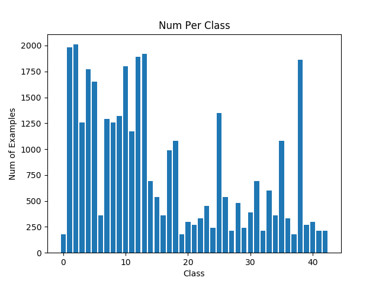
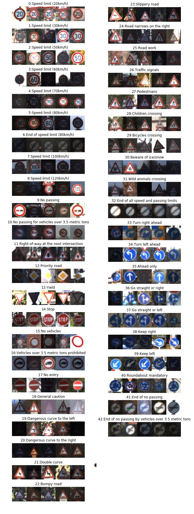
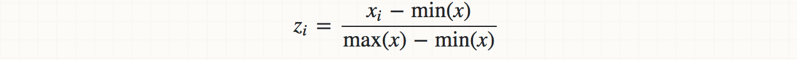
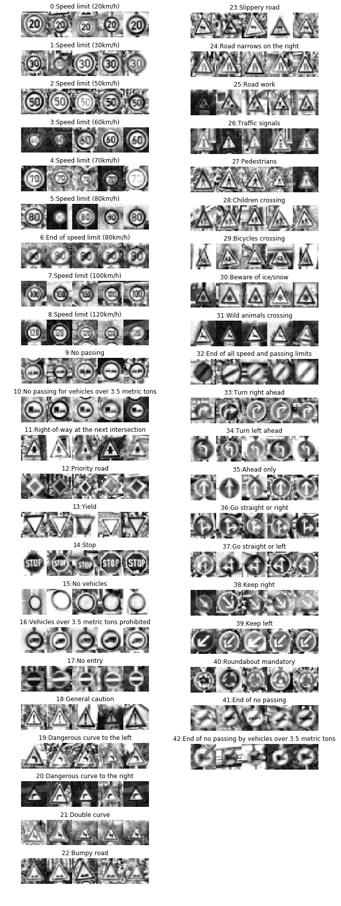
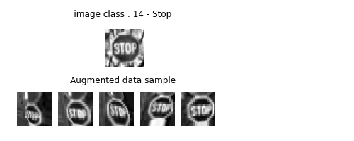
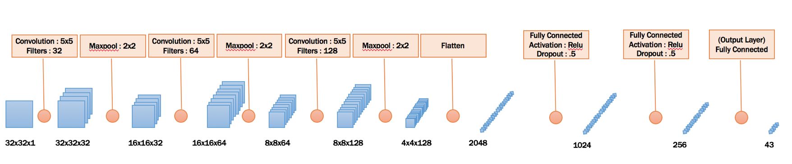
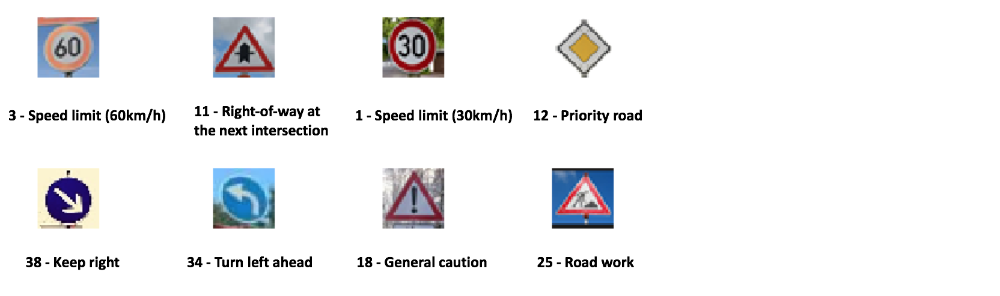

# Traffic Sign Recognition

### Build a Traffic Sign Recognition Project

This project will use convolutional neural networks and deep learning to classify/recognize the various traffic signs. Tensorflow library is used to build the neural net and the training is done on the German traffic signs dataset.

The goals / steps of this project are the following:
* Load the data set (see below for links to the project data set)
* Explore, summarize and visualize the data set
* Design, train and test a model architecture
* Use the model to make predictions on new images
* Analyze the softmax probabilities of the new images
* Summarize the results with a written report


---
### Rubric Points
Here I will consider the [rubric points](https://review.udacity.com/#!/rubrics/481/view) individually and describe how I addressed each point in my implementation.  

---
### Writeup / README

#### 1. Provide a Writeup / README that includes all the rubric points and how you addressed each one. You can submit your writeup as markdown or pdf. You can use this template as a guide for writing the report. The submission includes the project code.

You're reading it! and here is a link to my [project code](https://github.com/praveenmarothu/P2-Traffic-Sign-Classifier/blob/master/Traffic_Sign_Classifier.ipynb)

---

### Data Set Summary & Exploration

#### 1. Provide a basic summary of the data set. In the code, the analysis should be done using python, numpy and/or pandas methods rather than hardcoding results manually.

The data is loaded into variables and since they are numpy objects, I used the numpy shape() and list len() methods to get the summary of the data.

* The size of training set is 34799
* The size of test set is 12630
* The shape of a traffic sign image is (32, 32, 3)
* The number of unique classes/labels in the data set is 43

#### 2. Include an exploratory visualization of the dataset.

Here is an exploratory visualization of the data set. It is a bar chart showing how the data is distributed across the various classes. Also followed is a sample images from each class.





---

### Design and Test a Model Architecture

#### 1. Describe how you preprocessed the image data. What techniques were chosen and why did you choose these techniques? Consider including images showing the output of each preprocessing technique. Pre-processing refers to techniques such as converting to grayscale, normalization, etc. (OPTIONAL: As described in the "Stand Out Suggestions" part of the rubric, if you generated additional data for training, describe why you decided to generate additional data, how you generated the data, and provide example images of the additional data. Then describe the characteristics of the augmented training set like number of images in the set, number of images for each class, etc.)

To make the image data more suitable for the training purpose, I preprocessed the data using the below steps
1. Grayscale images
2. Histogram equalisation
3. Min Max scaling
4. Data augmentation
5. One hot encoding labels
6. Spliting training data to training and validation data

**Grayscale Images**

As a first step, I decided to convert the images to grayscale because it gave me better results over color images and also felt that the color was not a good differentiator expect for some cases. 

**Histogram equalisation**

Also I used contrast limited adaptive histogram equalisation (CLAHE) to improve contrast in images. I used CLAHE instead of ordinary histogram equalization becaise CLAHE improves local contrast and enhances the definitions of edges in each region of an image.

**Min Max scaling**

After the histogram equalisation, the data was run through a min max scaling to get the values in the 0 and 1 range which are suitable for our neural net training  I used the below formula to do the calculation.


Here is an example of a traffic signs images after grayscaling and normalisation.




**Data augmetation**

I decided to generate additional data because some classes had very few data points and the training for these classes may not sufficient to generated good enough results during predicting.

To add more data to the the data set, I transformed the existing images using AffineTransform() and the ProjectiveTransfom() from scikit using a transform parameters from a random distribution. I made sure that after the transform the images retain the same size as the original image.

```python
# Takes an images and perform a random transformation 
# and return the transformed image

def random_transform(img):

    image_size = img.shape[0]

    d = image_size * 0.2
    tl_top,tl_left,
    bl_bottom,bl_left,
    tr_top,tr_right,
    br_bottom,br_right = np.random.uniform(-d, d,size=8)   

    aft =  AffineTransform(scale=(1, 1/1.2))
    img= warp(img, aft,output_shape=(image_size, image_size), order = 1, mode = 'edge')
    transform = ProjectiveTransform()
    transform.estimate(np.array((
            (tl_left, tl_top),
            (bl_left, image_size - bl_bottom),
            (image_size - br_right, image_size - br_bottom),
            (image_size - tr_right, tr_top)
        )), np.array((
            (0, 0),
            (0, image_size),
            (image_size, image_size),
            (image_size, 0)
        )))

    img = warp(img, transform, output_shape=(image_size, image_size), order = 1, mode = 'edge')
    return img
```

Here is an example of an original image and the transformed images:



**One Hot Encoding Labels**

All the labels are one hot encoded. This will be right way to later match the predictions from the network with the labels to calculate the accuracy.

**Spliting training data to training and validation data**

The training data was split into training and validation data using the train_test_split() of the scikit learn library. 95% data was used for the training and 5% data for the validation.

#### 2. Describe what your final model architecture looks like including model type, layers, layer sizes, connectivity, etc.) Consider including a diagram and/or table describing the final model.

My final model consisted of the following layers:




| Layer         		|     Description	        					| 
|:---------------------:|:---------------------------------------------:| 
| Input         		| 32x32x1 Grayscale image   							| 
| Convolution 5x5     	| 1x1 stride, same padding, outputs 32x32x32 	|
| RELU					|												|
| Max pooling	      	| 2x2 stride,  outputs 16x16x32 				|
| Convolution 5x5     	| 1x1 stride, same padding, outputs 16x16x64 	|
| RELU					|												|
| Max pooling	      	| 2x2 stride,  outputs 8x8x32    				|
| Convolution 5x5     	| 1x1 stride, same padding, outputs 8x8x128 	|
| RELU					|												|
| Max pooling	      	| 2x2 stride,  outputs 4x4x128    				|
| Flatten				| outputs 2048									|
| Fully Connected		| outputs 1024									|
| RELU		            |           									|
| Dropout		        | 0.5		        							|
| Fully Connected		| outputs 265									|
| RELU		            |           									|
| Dropout		        | 0.5		        							|
| (Output Layer) Fully Connected| outputs 43							|
| 
 


#### 3. Describe how you trained your model. The discussion can include the type of optimizer, the batch size, number of epochs and any hyperparameters such as learning rate.

To train the model, I used AdamOptimizer to optimize the cost function. I used a learning rate of 0.001 since I felt that using this low learning rate will will be slow but more accurate.

I trained the model on AWS using a GPU instance (p2.xlarge, 1 GPU, 4 vCPU, 61GB RAM).

```python
# Training Operation
    cross_entropy = tf.nn.softmax_cross_entropy_with_logits(logits=network, labels=p_labels)
    loss_operation = tf.reduce_mean(cross_entropy)
    training_operation  = tf.train.AdamOptimizer(learning_rate).minimize(loss_operation)

```

#### 4. Describe the approach taken for finding a solution and getting the validation set accuracy to be at least 0.93. Include in the discussion the results on the training, validation and test sets and where in the code these were calculated. Your approach may have been an iterative process, in which case, outline the steps you took to get to the final solution and why you chose those steps. Perhaps your solution involved an already well known implementation or architecture. In this case, discuss why you think the architecture is suitable for the current problem.

My final model results were:
* validation accuracy of : 98.78%
* test set accuracy of : 93.02%

If an iterative approach was chosen:

**What was the first architecture that was tried and why was it chosen?**

The first architecture that I chose was Lenet as described in the Udacity course. I chose this architecture as Lenet is a simple architecture, and also The traffic signs classification is not a highly complex problem to solve. I think Lenet is a good candidate for this project.

**What were some problems with the initial architecture?**

The validation accuracy was close to 91% - 93%.

**How was the architecture adjusted and why was it adjusted?**

I tried the below changes

1. Added extra convolution layer
2. Changed the output size for the convolution layers. ist layer 32, 2nd layer 64 and 3rd layer 128
3. Added maxpool layer to downsize
4. Added an extra fully connected layer
5. Added dropout at each fully connected layer except the output layer.

**Which parameters were tuned? How were they adjusted and why?**

The learning rate parameter was an important tuning parameter that I had to tune. I tried with various values and felt that 0.001 gave a good tradeoff between speed and accuracy. 

The number of epochs was another parameter that I had to work on. I setelled for an epoch value of 20 after observing the validation accuracy. And in my case iterations after 20 did not give any higher accuracy.

I also tested with various batch size parameters. any value between 100-150 gave be good results. I used a value of 128.
 
---

### Test a Model on New Images

#### 1. Choose five German traffic signs found on the web and provide them in the report.

Here are five German traffic signs that I found on the web:



The last image (25-Road Work) sign is hard to classify due to the small complex sign within the triangle. For other images, except that the some images have a natural backgroud , the qualities of the signs in the images are all pretty clear.

#### 2. Discuss the model's predictions on these new traffic signs and compare the results to predicting on the test set. At a minimum, discuss what the predictions were, the accuracy on these new predictions, and compare the accuracy to the accuracy on the test set.


Here are the results of the prediction:

| Image			        |     Prediction	        					| 
|:---------------------:|:---------------------------------------------:| 
|3 - Speed limit (60km/h)|3 - Speed limit (60km/h)| 
|11 - Right-of-way at the next intersection|11 - Right-of-way at the next intersection|
|1 - Speed limit (30km/h)|1 - Speed limit (30km/h)|
|12 - Priority road|12 - Priority road|
|38 - Keep right|38 - Keep right|
|34 - Turn left ahead|34 - Turn left ahead|
|18 - General caution|18 - General caution|
|25 - Road work|25 - Road work|


The model was able to correctly guess 8 of the 8 traffic signs, which gives an accuracy of 100%. I think the model might have difficulties on images that are far more distorted.

#### 3. Describe how certain the model is when predicting on each of the five new images by looking at the softmax probabilities for each prediction. Provide the top 3 softmax probabilities for each image along with the sign type of each probability. 

The code for making predictions on my final model is located in the last cell of the Ipython notebook.

For most of the cases the probalilities are close to 100%. The reason might be clear images that I have used. 

The top three soft max probabilities are listed below

---
**Correct Sign : 3 - Speed limit (60km/h)**
| Probability        	|     Prediction	        					| 
|---------------------:|:---------------------------------------------| 
|98.12%|3  - Speed limit (60km/h)                    
|1.50%|34 - Turn left ahead                         
|0.26%|29 - Bicycles crossing                       
||


**Correct Sign : 11 - Right-of-way at the next intersection**
| Probability        	|     Prediction	        					| 
|---------------------:|:---------------------------------------------| 
|99.52% |11 - Right-of-way at the next intersection   
|0.48%  |30 - Beware of ice/snow                      
|0.00%  |27 - Pedestrians                             
||


**Correct Sign : 1 - Speed limit (30km/h)**

| Probability        	|     Prediction	        					| 
|---------------------:|:---------------------------------------------| 
|100.00%|1  - Speed limit (30km/h)                    
|0.00%|2  - Speed limit (50km/h)                    
|0.00%|38 - Keep right                              
||


**Correct Sign : 12 - Priority road**

| Probability        	|     Prediction	        					| 
|---------------------:|:---------------------------------------------| 
|100.00%|12 - Priority road                           
|0.00%|11 - Right-of-way at the next intersection   
|0.00%|34 - Turn left ahead                         
||


**Correct Sign : 38 - Keep right**
| Probability        	|     Prediction	        					| 
|---------------------:|:---------------------------------------------| 
|100.00%| 38 - Keep right                              
|0.00%|34 - Turn left ahead                         
|0.00%|2  - Speed limit (50km/h)                    
||

**Correct Sign : 34 - Turn left ahead**

| Probability        	|     Prediction	        					| 
|---------------------:|:---------------------------------------------| 
|100.00%|34 - Turn left ahead                         
|0.00%|38 - Keep right                              
|0.00%|36 - Go straight or right                    
||


**Correct Sign : 18 - General caution**

| Probability        	|     Prediction	        					| 
|---------------------:|:---------------------------------------------| 
|100.00%|18 - General caution                         
|0.00%|26 - Traffic signals                         
|0.00%|35 - Ahead only                              
||

**Correct Sign : 25 - Road work**
| Probability        	|     Prediction	        					| 
|---------------------:|:---------------------------------------------| 
|98.98%|25 - Road work                               
|1.01%|30 - Beware of ice/snow                      
|0.01%|29 - Bicycles crossing                       
||
